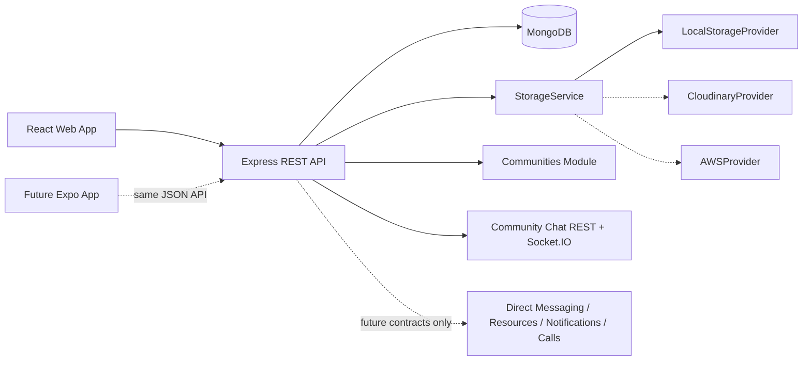

# StudyConnect Phase 1 Architecture

## System Context

## Backend Boundaries

- Routes define transport and middleware order.
- Controllers translate HTTP requests and responses.
- Services own business rules and orchestration.
- Repositories own persistence queries.
- Models define MongoDB documents and indexes.
- Providers isolate external storage and email infrastructure.
- Validators parse all mutable request input before it reaches services.

## Authentication

1. Register or login issues a 15-minute access token and a rotating refresh token.
2. Web receives refresh credentials in an `httpOnly`, scoped cookie.
3. A future mobile client sends `X-Client-Platform: mobile` and receives the refresh token in JSON for secure-device storage.
4. Refresh rotation revokes the presented token before issuing its replacement.
5. Reuse of an unknown or revoked token revokes all active sessions for that user.
6. Password changes and resets revoke all refresh sessions.

## Authorization

`authenticate` validates identity and account status. `authorize(...roles)` is the reusable RBAC gate. Phase 1 creates `STUDENT` accounts only; `ADMIN`, `COMMUNITY_ADMIN`, and `MODERATOR` are modeled for controlled assignment by later administration tooling.

## Communities Module

Phase 2 activates Communities as a REST module with `Community` and `CommunityMember` collections. The service layer owns slug generation, membership rules, owner/moderator permissions, member counts, and banner upload orchestration. The schema includes `extensionPoints` flags so chat, resources, and notifications can attach later without changing community identity or membership documents.

## Community Chat Module

Phase 3 activates community-scoped chat with Socket.IO rooms named `community:<id>`. Socket authentication reuses JWT access tokens, and every room/event action checks `CommunityMember` before participation. REST remains responsible for paginated history and multipart attachment messages; Socket.IO handles real-time text messages, edits, deletes, typing, presence, joins, and leaves.

The socket boundary exposes future module names for direct messaging and call signaling, but those gateways are not implemented.

## Future Module Boundary

Direct message, resource, notification, and report placeholder schemas preserve naming and relationship direction but are not mounted behind feature routes. WebRTC, voice, video, and screen sharing remain out of scope.
